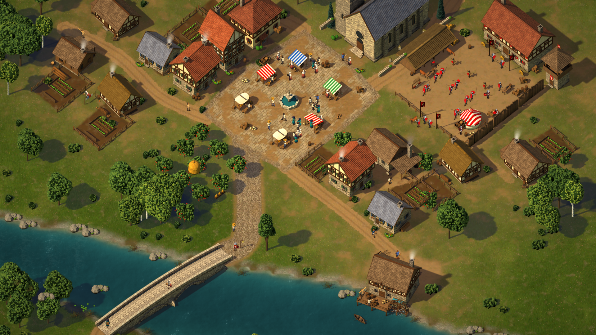
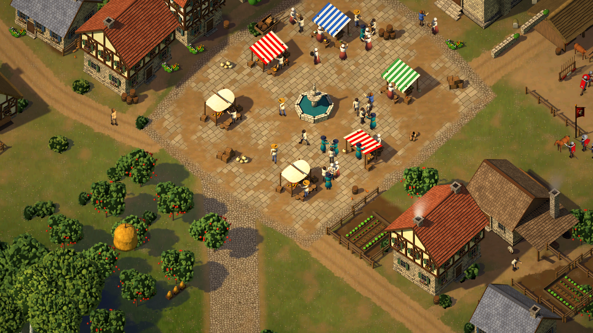
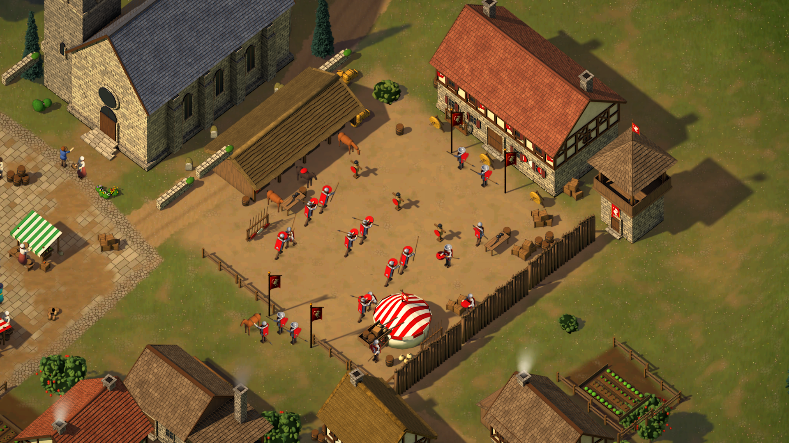
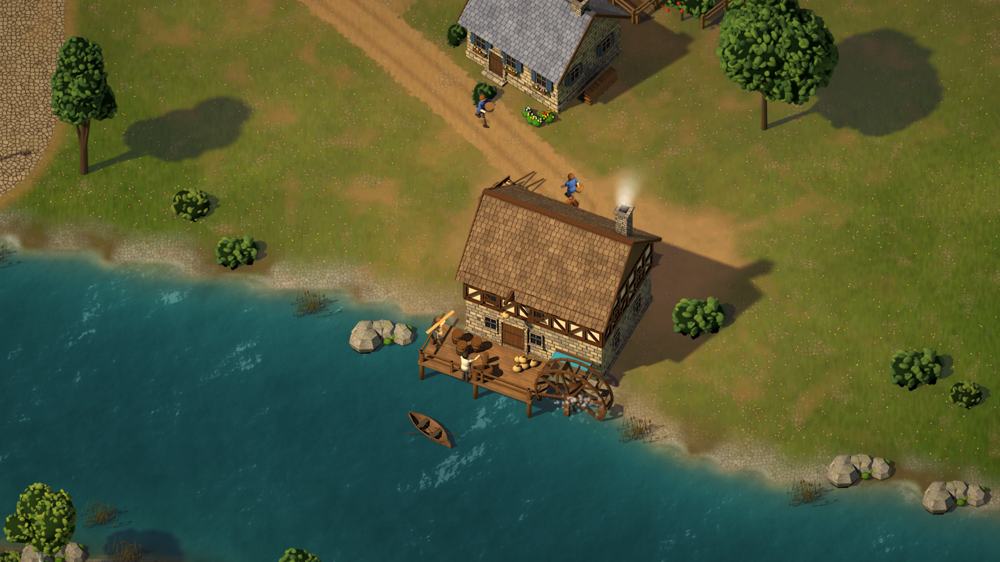

# KING'S DOMAIN — Fase 1B: vertical slice grafico della Valle

Obiettivo unico della fase: **dimostrare che la Valle può raggiungere il linguaggio visivo e la densità delle
immagini di riferimento** (A valle, B villaggio, C ravvicinato, D militare), su una porzione piccola ma
completa: il quartiere sul fiume di Altavera. Nessuna UI, nessun sistema nuovo, nessuna espansione del mondo
esterno.

Tutto ciò che si vede è **generato da codice** (Python + Blender 4.5 + Godot 4.7.2), rigenerabile con i comandi
del §2. Nessun asset disegnato a mano o preso da librerie. Gli screenshot sono **catture automatiche del gioco
in esecuzione**, non ritoccate.

## Screenshot richiesti (1920×1080) — `screenshots/phase1b/`

| Richiesto | File | Cosa mostra |
|---|---|---|
| FAR | `VERTICAL_SLICE_FAR.png` | il quartiere nella valle: fiume, ponte, mulino, campi oltre il fiume, foresta, colline |
| MID | `VERTICAL_SLICE_MID.png` | piazza del mercato, chiesa, case, caserma, mulino, ponte |
| CLOSE | `VERTICAL_SLICE_CLOSE.png` | piazza: bancarelle, fontana, cittadini, case, frutteto, fucina |
| MARKET_CLOSE | `MARKET_CLOSE.png` | mercato da vicino: merci, mercanti, clienti, casse, botti, carro |
| MILL_CLOSE | `MILL_CLOSE.png` | mulino ad acqua con ruota animata, pontile, barca, sacchi, portatori |
| MILITARY_CLOSE | `MILITARY_CLOSE.png` | caserma, scuderia, torre, palizzata, bersagli, manichini, tenda, soldati |
| RESIDENTIAL_CLOSE | `RESIDENTIAL_CLOSE.png` | vicolo residenziale: case diverse, orti, bucato, legnaie, galline |
| RIVER_CLOSE | `RIVER_CLOSE.png` | ponte in pietra, rive con massi e canne, acqua animata |
| (in più) | `FARM_CLOSE.png`, `VALLEY_FAR_1B.png` | fattoria e campi; tutta la valle con le nuvole ai bordi |

Confronti (tavole REFERENCE | CURRENT, gioco non ritoccato, tavolozza k-means sotto ciascuna immagine):

| Tavola | Riferimento | Cattura |
|---|---|---|
| `compare/COMPARE_REFERENCE_MID.png` | B — villaggio | VERTICAL_SLICE_MID |
| `compare/COMPARE_REFERENCE_CLOSE.png` | C — ravvicinato | VERTICAL_SLICE_CLOSE |
| `compare/COMPARE_REFERENCE_MILITARY.png` | D — militare | MILITARY_CLOSE |
| `compare/COMPARE_REFERENCE_VALLEY.png` | A — valle | VALLEY_FAR_1B |
| `compare/ITERATION_*.png` | iterazione 1 → 2 (prima e dopo l'autocritica) | |
| `compare/PHASE1_VS_PHASE1B.png` | Fase 1 → Fase 1B | |

La prima versione completa (iterazione 1) è conservata in `screenshots/phase1b/iter1/` con le sue tavole.






---

## 1. Cosa è cambiato rispetto alla Fase 1

| Area | Fase 1 | Fase 1B |
|---|---|---|
| Kit Blender | materiali semplici, tetti a texture, luce neutra | kit v2: materiali con occlusione ambientale, tetti costruiti tegola per tegola / fascio per fascio, contorno a inchiostro, luce "illustrata", ombre su più piani (terra e acqua) |
| Case | 17 tipi, stile uniforme | 8 varianti realmente diverse (pietra, intonaco, graticcio, assi, tronchi; paglia, scandole, coppi, coppi scuri, ardesia), ognuna col suo corredo |
| Landmark | chiesa e mulino generici | chiesa con campanile e sagrato, mulino ad acqua con ruota animata, ponte ad archi con parapetti, fontana, 4 bancarelle |
| Militare | assente come zona | caserma, scuderia, torre di guardia, palizzata, bersagli, manichini, rastrelliere, tenda, stendardi animati, soldati che si addestrano |
| Terreno del villaggio | terreno della valle + decalcomanie | terreno dipinto a 32 px/m: prato, terra battuta, cortili, orti, campi, rive, 4 classi di strade, piazza lastricata |
| Persone | 7 ruoli, 4 animazioni | 9 ruoli con abiti e attrezzi propri, 6 animazioni (idle, walk, carry, work, talk, train), 82 persone nel quartiere |
| Animali | nessuno | cavalli (2 mantelli), mucca, maiali, pecore, galline: idle, walk, graze — 30 nel quartiere |
| Effetti | fumo semplice | fumo dei camini e della forgia, ruota del mulino, schiuma, stendardi al vento, alberi al vento, nuvole ai bordi, grade colore nel renderer |
| Città | la città occupava la valle | il quartiere è una parte piccola della valle; il resto della valle si raccorda alle sue uscite |

## 2. Pipeline

```
pipeline/layout/slice.py                     composizione del quartiere (oggetti, persone, animali, strade, campi, cortili)
   └─ game/data/valley/slice.json + slice_sprites.json (solo gli sprite che il layout usa, con l'angolo)
pipeline/blender/slice_assets.py --from-layout   edifici, landmark, prop      → game/assets/sprites/slice/*.png + _sh.png + slice.json
pipeline/blender/people2.py                      9 ruoli × 5 direzioni         → game/assets/sprites/people/
pipeline/blender/animals.py                      6 specie × 5 direzioni        → game/assets/sprites/animals/
pipeline/layout/slice_ground.py                  terreno dipinto 32 px/m       → game/assets/slice_ground/*.webp + slice_ground.json
pipeline/layout/demo_town.py                     il resto della valle, raccordato alle uscite del quartiere
pipeline/terrain/plan_vegetation.py              vegetazione del quartiere e della valle
pipeline/textures/make_clouds.py                 cumuli ai bordi della mappa
pipeline/godot_import.py                         impostazioni di import (WebP del terreno compresse in VRAM)
pipeline/capture.sh res://data/capture/slice_views.json <cartella>        screenshot + misure
pipeline/tools/compare_1b.py <cartella> <cartella>/compare [--before <iter1>]   tavole di confronto
godot --path game -- --benchmark --views=res://data/capture/slice_views.json   benchmark su hardware vero
```

Regola: **si renderizza quello che il layout chiede**. Ogni oggetto del layout dichiara sprite e angolo
(`house_town@049`); Blender produce esattamente quegli sprite, con ombra a terra separata (`_sh.png`), ancora a
terra, impronta, punti fumo e punti di aggancio (ruota del mulino) in coordinate mondo. Il layout legge le
impronte renderizzate e sposta fuori dagli edifici le persone che ci finirebbero dentro.

## 3. Asset Blender (kit v2)

`pipeline/blender/kit2.py`, scritto per avvicinarsi al linguaggio "illustrato" dei riferimenti:

- **Materiali procedurali con occlusione ambientale** moltiplicata nel colore: intonaco con macchie e sporco verso
  terra; **muratura a corsi** (blocchi di larghezza irregolare, giunti sfalsati per corso, tono per blocco, bordi
  arrotondati, malta incassata); pietrame irregolare (muretti, pozzi); lastre rettangolari (pavimenti, ponte);
  travi, assi, tronchi; stoffa a righe; ferro; vetro scuro; roccia con crepe, licheni e muschio; paglia/fieno
  in coordinate oggetto con sagoma irregolare.
- **Tetti costruiti** (non texture): paglia a file continue con bordo ondulato e gronda spessa, colmi e bordi in
  paglia vera; scandole; coppi; coppi scuri; ardesia. Tono per elemento + macchie larghe di invecchiamento e
  muschio. Tetto a capanna, a padiglione, a falda singola, conico, **piramidale** (campanile).
- **Contorno a inchiostro** (Freestyle, 1,7 px, alfa 0,72) solo sugli spigoli veri; esclusi i piani di servizio.
- **Luce illustrata**: sole caldo forte, cielo freddo debole; grade (saturazione 1,16, contrasto 1,07, caldo) e
  maschera di contrasto leggera dopo il ridimensionamento 2× → 1×.
- **Ombre su più piani e taglio sotto l'acqua**: ogni asset ha piani d'ombra alla quota della terra e
  dell'acqua (−1,55 m per mulino e ponte); un piano *holdout* rende trasparente ciò che sta sotto l'acqua o sotto
  la riva, così in gioco l'acqua vera passa sotto archi, pali e pale.

| Gruppo | Asset |
|---|---|
| Case (8 varianti) | `house_cottage` (graticcio + paglia), `house_farm` (pietra, paglia vecchia a padiglione), `house_town` (pietra + piano a sbalzo in graticcio, coppi), `house_stone` (pietra, ardesia), `house_cabin` (tronchi, scandole, portico), `house_merchant` (intonaco + graticcio, coppi scuri a padiglione, tettoia), `house_tall` (3 piani, timpano su strada), `house_timber` (graticcio, scandole, tettoia laterale) |
| Landmark | `church` (contrafforti, lancette, rosone, abside, campanile con cuspide piramidale), `mill` + 8 fotogrammi `mill_wheel_*`, `bridge` (36 m, due archi ribassati e pila centrale con rostri, parapetti con copertina, impalcato lastricato a schiena d'asino), `fountain` |
| Mercato | `stall_canvas`, `stall_red`, `stall_blue`, `stall_green` (tendone, banco, espositore frontale, merci) |
| Produzione | `smithy` (forgia luminosa, incudine, mola, abbeveratoio, carbone, attrezzi) |
| Militare | `barracks` (stendardi col leone), `stable` (fronte aperto, fieno, mangiatoie, selle), `watchtower` (braciere), `palisade`, `tent`, `target`, `dummy`, `weapon_rack`, `weapons_table`, `banner_pole` |
| Prop (≈ 45 tipi) | carri (fieno, merci, tronchi, pietra), carriola, botti, casse, sacchi, covoni, balle, legna, tronchi, assi, steccati (pali e traverse, intrecciato), muretti, orti, fiori, rose, girasoli, panca, abbeveratoio, pozzo, croci e lapidi con tumulo, lanterna, cartello, barca, canne, ninfee, ceppo, massi di riva, arnie, bucato, pollaio, vasellame, attrezzi |

## 4. Sprite e atlanti

| Insieme | Contenuto | Dimensione |
|---|---|---|
| Quartiere | 76 sprite (corpo RGBA + ombra L separata), 32 px/m, renderizzati 2× e ridotti | 6,7 Mpx, 6,0 MB PNG |
| Persone | 9 atlanti (uno per ruolo), celle 72×92 px, righe `anim_DIREZIONE` | 4,2 MB |
| Animali | 6 atlanti, celle da 40×40 (gallina) a 128×112 (cavallo) | 0,8 MB |
| Terreno dipinto | 12 tessere 2048² WebP, compresse in VRAM all'import | 6,4 MB |
| Nuvole | 6 cumuli 1024×640 | — |

Lo sprite più grande è la chiesa (1077×861). L'ombra a terra è un'immagine a parte disegnata in un livello
d'ombra comune (moltiplicata, colore freddo), così le ombre di edifici diversi non si sommano.

## 5. Sistema dei prop

Un prop è un'entrata del catalogo (`slice_props.py` / `slice_landmarks.py`): generatore Blender, piani d'ombra,
angoli ammessi (i prop simmetrici sono quantizzati per riusare gli sprite). Nel layout è un oggetto
`{sprite, x, y, z?}`. La regola del brief **"ogni edificio ha un piccolo ecosistema"** è nel codice:
`building(..., eco=[...])` posiziona il corredo nel riferimento locale dell'edificio (ruota con lui), e ogni
edificio riceve terra battuta, cespugli e, per le case, un sentiero dalla porta alla strada.

- casa → orto recintato, legnaia, bucato, panca, botti, fiori, terra battuta, sentiero alla porta;
- fattoria → recinto dei maiali con fango, pollaio e galline, covoni, carro del fieno, abbeveratoio;
- mulino → pontile con sacchi, botti e casse, carro col cavallo, portatori di sacchi, barca, canne e massi;
- fucina → incudine, mola, carbone, legna, rastrelliera degli attrezzi, fabbro al lavoro, fumo scuro;
- caserma → palizzata, torre di guardia, bersagli, manichini, rastrelliere, tavolo delle armi, tenda, carro,
  casse e botti, stendardi, scuderia con cavalli, soldati in addestramento e in duello, guardie alla porta;
- chiesa → sagrato, muretto, croci e lapidi, tassi; mercato → 6 bancarelle, fontana, merci, carro.

## 6. Sistema degli edifici

`slice_assets.house(...)` è un generatore parametrico: piani (pietra / intonaco / graticcio / assi / tronchi),
zoccolo, sbalzo, tetto (tipo, pendenza, sporto, padiglione, colmo), camini, finestre con scuri e fioriere, porta
con cornice e tettoia, tettoie laterali, portico, legnaia, botti. Le 8 varianti sono combinazioni diverse di
materiali e proporzioni, non ricolorazioni. Gli edifici sono ruotati di ±45°/±135° su una griglia di strade
diagonali: si vedono **due facciate e il tetto**, come nei riferimenti. 12 case nel quartiere (4 riusano sprite
già renderizzati), più chiesa, mulino, fucina, caserma, scuderia, torre, fattoria.

## 7. Cittadini

`people2.py`: figure modellate (capsule articolate, abiti a strati, cappelli, attrezzi). Ruoli: contadino
(cappello di paglia, zappa, sacco), boscaiolo (berretto rosso, ascia, tronchi), costruttore (grembiule, martello,
asse), artigiano (grembiule di cuoio, martello, cassa), mercante (tunica verde-azzurra, cintura), guardia e
soldato (cotta di maglia, sopravveste rossa col leone, lancia, scudo, elmo), cittadino, donna (abito, grembiule,
fazzoletto, cesto). In gioco sono disegnati 1,15 volte più grandi del vero, come nei riferimenti.

82 persone nel quartiere: mercanti e clienti alle bancarelle, gruppi che chiacchierano in piazza, viandanti e
portatori sulle strade, contadini nei campi, fabbro, lavandaia, boscaiolo, costruttore, portatori al mulino,
14 soldati (in fila, in duello, di passaggio, a riposo) e 6 guardie (porta della caserma, ponte, piazza d'armi).

## 8. Animazioni

| Cosa | Come |
|---|---|
| Persone | atlante a 5 direzioni + 3 specchiate; idle 4 fotogrammi, walk 8, carry 8, work 8, talk 8, train 8 (affondo di lancia) |
| Comportamenti | `actor_layer.gd`: percorso avanti/indietro (cammina o trasporta), vagabondaggio intorno a un punto con pause (le persone parlano, gli animali brucano), attività ferma (lavoro, dialogo, addestramento). Sul ponte l'attore segue la gobba dell'impalcato. Solo gli attori vicini alla vista sono aggiornati |
| Animali | idle 4, walk 8, graze 4 (testa al suolo) |
| Mulino | ruota a 8 fotogrammi renderizzati (8 fps), schiuma a gocce sotto le pale |
| Fumo | camini (~70 % delle case) e forgia (più scuro): sbuffi che salgono, derivano col vento, si allargano e svaniscono |
| Stendardi | shader: onda che cresce allontanandosi dall'asta |
| Alberi | shader MultiMesh: oscillazione con fase per istanza, ampiezza costante in pixel, solo da vicino |
| Acqua | shader: increspature trasportate dalla corrente, creste, caustiche, schiuma di riva che respira |

## 9. Acqua

`terrain.gdshader`: tre toni per profondità (verde-acqua misurato sui riferimenti; bassi più chiari e verdi, si
vede il fondo), increspature e creste trasportate dalla corrente, caustiche sul fondo basso, schiuma sottile
che respira lungo la riva, trasparenza verso riva. Rive dipinte (fango, ghiaia, ciottoli), 32 gruppi di massi,
canne, ninfee, cespugli e qualche albero lungo entrambe le sponde. Ponte e mulino proiettano l'ombra sull'acqua
alla quota giusta e lasciano vedere l'acqua sotto archi e pontile.

## 10. Terreno

Terreno dipinto a 32 px/m (1 texel = 1 pixel a zoom 1), con la stessa luce del terreno della valle: prato a più
scale (fili d'erba, ciuffi, rari fiori); **erba di villaggio** più secca e calpestata entro ~16 m dagli edifici,
con chiazze di terra; terra battuta intorno agli edifici; cortili; fango; orti; campi (grano con spighe, arato a
solchi profondi, ortaggi a file); rive. È proiettato con la stessa proiezione obliqua del terreno (scansione per
colonne, compilata con numba) e tagliato in tessere WebP compresse in VRAM. Il bordo esterno è sfumato e
rumoroso: il quartiere entra nella valle senza cucitura. La tavolozza è misurata sui riferimenti (erba oliva,
terra calda).

## 11. Strade

Cinque classi, curve Catmull-Rom con larghezza e bordi irregolari (ciuffi d'erba sul bordo):
**sentiero** (1,8–2 m: dalle porte alla strada, nei campi), **rurale** (3,4–4,4 m, solchi delle ruote, sassi),
**vicolo** (3,6 m), **urbana** (5,6 m, acciottolato a pietre singole), **piazza** (lastre in file, cornice di
ciottoli, terra battuta dove si cammina, lastre mancanti). Le strade si raccordano alle uscite (nord, ovest, est,
ponte) usate dalla rete stradale della valle.

## 12. Vegetazione

Gli alberi del quartiere sono istanze della vegetazione della valle (stesse MultiMesh): frutteti, tassi del
sagrato, alberi da frutto negli orti, 9 boschetti e ~70 alberi/cespugli nei vuoti (lontano da strade, tetti e
acqua), cespugli e alberi lungo le rive. Il quartiere è escluso dal riempimento automatico della foresta e dai
massi della collina. Fiori, rose, girasoli, orti, canne, ninfee sono prop renderizzati.

## 13. Prestazioni

<<PERF>>

## 14. Problemi incontrati

Formato: PROBLEMA / CAUSA / LIMITE / SOLUZIONI / SOLUZIONE SCELTA.

1. **Pietra "granito" invece di conci** (caserma, ponte: superfici rumorose, nessuna pietra leggibile).
   CAUSA: il nodo Voronoi di Blender 4.x ha un ingresso *Scale* con valore predefinito 5, che si moltiplica alla
   mia scala → pietre 5 volte più piccole (2–3 px). LIMITE: nessuno, era un errore mio.
   SOLUZIONI: (a) correggere la scala; (b) passare a un motivo a corsi. SCELTA: entrambe — `kit2.voronoi()` con
   Scale = 1 per il pietrame irregolare (`rubble`), e muratura **a corsi** (nodo Brick con giunti spostati per corso,
   bordi arrotondati, tono per blocco) per pareti, ponte, chiesa; lastre rettangolari per i pavimenti.
2. **Righe sulle teste dei muri e sulle copertine**. CAUSA: mappatura (x+y, z) anche sulle facce orizzontali.
   SCELTA: mappatura che usa la normale: (x, y) sulle facce orizzontali.
3. **Parti sott'acqua disegnate sopra l'acqua** (pile del mulino, pale della ruota, piedi del ponte; blocchi neri alle
   testate del ponte sotto il livello della riva). CAUSA: lo sprite contiene tutta la geometria; in gioco l'acqua
   è sotto lo sprite. SOLUZIONI: (a) tagliare a mano ogni modello; (b) piano "holdout" in Blender. SCELTA: (b) —
   un piano holdout visibile solo alla camera sotto ogni piano d'ombra (acqua e riva): ciò che è sotto diventa
   trasparente. Freestyle però disegnava ancora i contorni della geometria nascosta: la copertura (alfa) è ora
   calcolata in un passaggio senza inchiostro, quindi le linee fuori dalla geometria visibile spariscono.
4. **Paglia arancione liscia** su covoni, balle, carro del fieno, arnie, bersagli ("uovo" arancione).
   CAUSA: il materiale del tetto di paglia usa attributi e UV che esistono solo sulle falde costruite.
   SCELTA: nuovo materiale `straw` (fibre in coordinate oggetto) + spostamento a nuvola per una sagoma irregolare.
5. **Tegole a "mosaico"** (tessere di 7 px tutte di tono diverso, arancioni). SCELTA: tegole più grandi, variazione
   di tono soprattutto a macchie larghe (invecchiamento), tavolozza meno satura.
6. **Prato verde lime, piazza grigia "parcheggio"**. CAUSA: tavolozza scelta a occhio. SCELTA: colori misurati sui
   riferimenti (mediana erba B/C ≈ (56,68,29) contro la nostra (75,109,21); terra ≈ (166,132,84)); piazza a lastre
   in file con terra battuta dove si cammina, lastre mancanti; bordi di strade più netti con ciuffi d'erba.
7. **Acqua blu reale con creste a blocchi**. CAUSA: creste = sin(dot(g, dir)) con g in migliaia di metri e
   direzione del flusso che cambia da texel a texel → salti di fase. SCELTA: creste da rumore trasportato dal
   flusso (stabile); colori verde-acqua misurati sui riferimenti (≈ (49,87,91)).
8. **Alberi deformati dall'oscillazione** (taglio enorme). CAUSA: lo spostamento era in unità del quad, non in pixel.
   SCELTA: ampiezza divisa per la larghezza in pixel dell'istanza, fase per istanza, flag per non far oscillare
   rocce e steccati.
9. **Fumo dei camini invisibile** nell'iterazione 1. CAUSA: gli emettitori `CPUParticles2D` venivano creati
   (verificato: 10 nodi, visibili) ma non erano disegnati in questo renderer (OpenGL compatibilità su llvmpipe),
   nemmeno colorati di rosso o senza texture. LIMITE: non ho una GPU per capire se è un problema solo del
   renderer software. SOLUZIONI: (a) GPUParticles; (b) fumo a sprite. SCELTA: (b) `fx/smoke_plume.gd`, 7 sbuffi
   in ciclo deterministico: costa pochissimo e si vede ovunque. La schiuma del mulino (che invece era disegnata,
   ma come quadratini) ora usa una goccia morbida.
10. **Ruota del mulino fuori posto** (4,5 m, sulla riva). CAUSA: nel layout la ruota veniva agganciata a
    `objects[-1]`, che dopo l'aggiunta dell'ecosistema del mulino era l'ultimo prop. SCELTA: aggancio esplicito al
    mulino; verificato misurando in gioco la posizione proiettata della ruota.
11. **Tutte le persone sui tetti** (regressione durante l'iterazione 2). CAUSA: avevo ingrandito il nodo che
    contiene la persona; il suo figlio contiene lo spostamento d'altezza del terreno (~2.200 px), che veniva
    ingrandito anch'esso del 15 %. SCELTA: si ingrandisce solo lo sprite e si corregge l'ancora; aggiunto un
    controllo nel layout che sposta fuori dagli edifici chi ci finisce dentro.
12. **Cavalli "a palloncino"**. CAUSA: segno sbagliato della rotazione del collo (la testa puntava indietro e in
    alto). SCELTA: catena collo → testa ricostruita, proporzioni da cavallo da sella; verificata su render di prova
    da 4 lati e al pascolo prima di rifare gli atlanti.
13. **Tempi di render** (solo CPU, 4 core): ogni correzione del kit obbliga a rifare gli sprite interessati
   (≈ 3–10 min per edificio). Le correzioni sono state verificate su render di prova piccoli prima di rilanciare.

### Autocritica (iterazione 1 → iterazione 2)

Screenshot dell'iterazione 1 (prima versione completa, con persone e animali): `screenshots/phase1b/iter1/`,
con le tavole di confronto in `screenshots/phase1b/iter1/compare/`. Li ho aperti uno per uno e confrontati con i
riferimenti A, B, C e D. Questa è la tabella che ne è uscita, con quello che ho fatto nell'iterazione 2.

| ELEMENTO | REFERENCE | CURRENT (iter. 1) | GAP | AZIONE (iter. 2) |
|---|---|---|---|---|
| Suolo del villaggio | B/C: tra le case terra battuta, sentierini a ogni porta, erba solo a chiazze | prati verdi uniformi tra le case e tra i quartieri | **grande** | erba "di villaggio" (più secca, calpestata, chiazze di terra) entro ~16 m da ogni edificio; terra battuta intorno alle case più larga (20×17 m); 9 sentieri dalle porte alla strada più vicina |
| Densità | B: case vicine, alberi a gruppi, nessun vuoto | 12 case sparse, grandi prati vuoti | **grande** | +4 case (sprite già renderizzati, angoli riusati), 70 alberi/cespugli nei vuoti lontano da strade e tetti, 9 boschetti, orti recintati (57 segmenti di steccato) |
| Fumo dei camini | B/C: fumo da quasi ogni camino | **assente**: gli emettitori CPUParticles2D esistevano (10, visibili) ma non venivano disegnati | difetto | nuovo fumo a sprite (`fx/smoke_plume.gd`: 7 sbuffi in ciclo, salgono, derivano, si allargano, svaniscono); fucina più scura. Verificato in cattura |
| Ruota del mulino | C: grande ruota sull'acqua, acqua bianca | ruota disegnata **4,5 m fuori posto**, sulla riva | difetto | causa: la ruota veniva agganciata a `objects[-1]`, che era l'ultimo prop dell'ecosistema del mulino; ora è agganciata al mulino. Schiuma a gocce morbide invece di quadratini |
| Cavalli e mucca | D: cavalli riconoscibili da lontano | "palloncini" con collo e testa rovesciati | difetto | rotazione del collo corretta (la testa guarda avanti e in basso, al pascolo il muso tocca l'erba), proporzioni da cavallo da sella (garrese 1,5 m, gambe lunghe, petto e groppa) |
| Persone | C/D: figure grandi, leggibili, molte | figure piccole e semplici | medio | scala 1,15 (sprite, non il nodo: un primo tentativo spostava tutti sui tetti, trovato e corretto); 18 persone in più (gruppi che chiacchierano, viandanti sulle strade, soldati) |
| Persone dentro gli edifici | — | 14 attori con il punto dentro un'impronta (orto dentro casa, soldato nella tenda, galline in casa) | piccolo | controllo automatico nel layout: chi cade in un'impronta viene spostato oltre il lato più vicino (9 spostati); i mercanti restano dietro il banco |
| Colore generale | A–D: luce calda, toni dorati e bruni, verdi oliva | verde dominante (primo colore della tavolozza ~30 %) | medio | grade nel renderer (caldo, saturazione 1,08, contrasto 1,07, vignetta leggera) + erba di villaggio; è un effetto del gioco, applicato a ogni frame, non un ritocco degli screenshot |
| Acqua e rive | B/C: turchese chiaro, fondo visibile, molti massi e canne | blu-verde scuro e piatto, riva quasi nuda | medio | 32 gruppi di massi Blender + canne + cespugli lungo le due rive, nuovo materiale roccia (muschio, crepe); acqua bassa più chiara e verde |
| Nuvole (A) | nuvole volumetriche con base in ombra | dischi bianchi piatti | medio | cumuli con volume (normali da un campo d'altezza, luce da nord-ovest, base e nuclei in ombra) |
| Macchie grigie vicino al quartiere | — | massi della collina del castello come macchie grigie sfocate | piccolo | esclusi dall'area del quartiere (+25 m), scala ridotta |
| Zona militare | D: cortile pieno (casse, botti, rastrelliere, carro), stendardi, soldati che si addestrano | tutti gli elementi c'erano, ma il cortile era vuoto | piccolo | +11 prop (casse, botti, sacchi, rastrelliera, tavolo, carro, 2 stendardi), 2 coppie di duellanti, porta con guardie, soldato che porta casse, cavallo con scudiero |
| Tetti | C: paglia spessa, irregolare, con muschio | puliti e regolari | medio | fili della paglia più grossi e colmi in paglia vera; **resta** più pulito del riferimento (vedi §15) |
| Angolo di camera | ~35–40° di elevazione, più facciata visibile | 50° | strutturale | **non cambiato**: è la proiezione del terreno e di tutti gli sprite (Fase 1); cambiarla vuol dire rifare tutto. Vedi §15–16 |
| Campi | B: grano dorato con covoni e steccati | campi grandi, piatti | medio | non affrontato in questa iterazione (vedi §15) |


## 15. Differenze rimanenti rispetto ai riferimenti

<<REMAINING>>

## 16. Cosa serve per arrivare alla qualità finale

<<FINAL>>

---

## Stato

Fase 1B completata. **Mi fermo qui: non inizio la Fase 2.** In attesa della tua approvazione.
