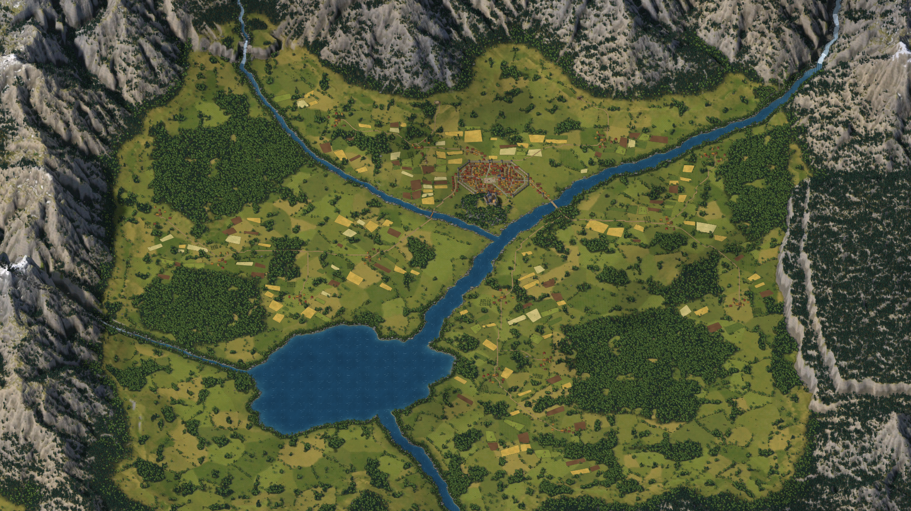
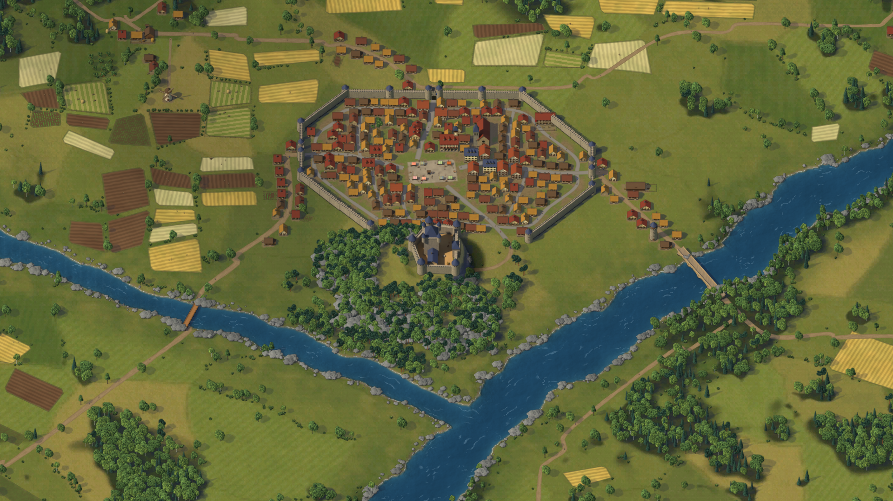
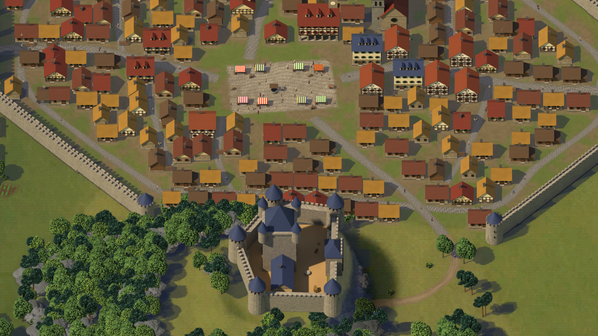
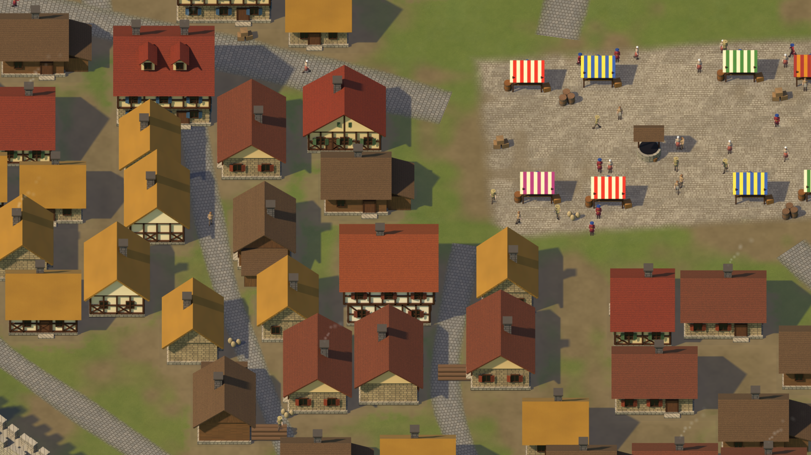

# KING'S DOMAIN — Fase 1: grafica della Valle

Obiettivo della fase: dimostrare che King's Domain può essere **visivamente bello**, costruendo il luogo in cui il
giocatore passerà gran parte della partita. Nessun gameplay definitivo: valle, acqua, foreste, montagne, campi,
edifici, cittadini, strade, camera e un insediamento dimostrativo.

Tutto ciò che si vede è **generato da codice** (Python + Blender 4.5 + Godot 4.7.2) e quindi rigenerabile e
migliorabile. Nessun asset è stato disegnato a mano né preso da librerie esterne.

## Screenshot (1920×1080, catturati automaticamente dal gioco)

Cartella: `screenshots/phase1/` — confronti con il riferimento in `screenshots/phase1/compare/`.

| Richiesto | File | Cosa mostra |
|---|---|---|
| VALLEY_FAR | `VALLEY_FAR.png` | tutta la valle: catene montuose, gole con cascate, lago, fiumi, foreste, città, 14 borghi |
| VALLEY_MID | `VALLEY_MID.png` | Altavera murata, castello sulla Rocca, confluenza, ponti, campi e borghi |
| VALLEY_CLOSE | `VALLEY_CLOSE.png` | la città: piazza del mercato, palazzo comunale, chiesa, mura, castello |
| VILLAGE_CLOSE | `VILLAGE_CLOSE.png` | case, vie acciottolate, bancarelle, cittadini, fumo dai camini |
| FOREST_TEST | `FOREST_TEST.png`, `FOREST_TEST_CLOSE.png` | foresta da lontano (massa) e da vicino (alberi singoli), fiume con rive sassose |
| WATER_TEST | `WATER_TEST.png`, `WATER_TEST_BRIDGE.png`, `WATER_TEST_LAKE.png` | cascata della valle sospesa, ponte in pietra sul Fiume Argento, rive del lago |
| BUILDINGS_TEST | `BUILDINGS_TEST.png`, `_B`, `_C`, `_PROPS` | tutta la libreria di edifici con varianti, orientamenti e oggetti |
| CITIZENS_TEST | `CITIZENS_TEST.png`, `CITIZENS_TEST_ZOOM.png` | 7 ruoli × fermo / cammina / trasporta / lavora |
| (in più) | `CASTLE_CLOSE.png`, `FIELDS_MID.png`, `HAMLET_CLOSE.png`, `MOUNTAINS_MID.png`, `CITIZENS_TOWN.png` | castello, campi, borgo, montagne, piazza con cittadini |







---

## 1. Cosa è stato realizzato

### 1.1 La Valle di Altavera (3,1 × 2,6 km giocabili + montagne di fondale)
Disegnata da me (non copiata dal riferimento), costruita attorno alla camera che guarda a nord:

| Elemento | Realizzazione |
|---|---|
| Montagne a nord (fondale) | 9 vette nominate e creste di collegamento, profilo concavo (ripide in alto, dolci al piede), modulazione *ridged multifractal* per creste frastagliate, **erosione stream-power** (valli dendritiche) + **erosione idraulica a gocce** a 4 m e 2 m + gradoni rocciosi e speroni. Fasce leggibili: bosco di conifere → roccia → neve (sopra ~420–480 m e nei canaloni). |
| Catena ovest | 4 vette più basse, rocciose, con boschi di conifere al piede |
| Altopiano est | **mesa** con cornici di roccia a due salti, sezionata dall'erosione, coperta di bosco |
| Colline sud | basse e boscose (non devono nascondere il fondovalle alla camera) |
| Gole | il Fiume Argento entra da una gola a nord-est con **due cascate** ed esce da una gola a sud |
| Valle sospesa | a nord-ovest, con la **cascata del Torrente Bianco** (~37 m) rivolta verso la camera |
| Rocca | colle roccioso tra i due fiumi, spianato in cima per il castello |
| Lago Specchio | lago irregolare a sud-ovest, profondità fino a 11 m |
| Rio Ponente | ruscello dalla catena ovest al lago |

### 1.2 Terreno
Il fondovalle è diviso in **appezzamenti di prato** (patchwork di Voronoi deformato: erba grassa, fresca, secca,
olivastra, alcuni sfalciati a strisce, con bordi più scuri) — il prato non è più un tappeto verde uniforme; lungo
una parte dei confini crescono **siepi** (bocage). Materiali con transizioni morbide: erba, prato alpino, terreno
fertile vicino all'acqua, terra, fango sulle rive, sabbia/ghiaia ai bordi dei fiumi, ghiaione, roccia (calda/fredda,
stratificata), neve, sottobosco sotto le chiome. Luce: sole da ovest-sud-ovest con **ombre portate calcolate**
(anche le ombre delle montagne sul fondovalle), occlusione ambientale multi-scala, accentuazione di creste e
cavità. Sulla roccia: luce in parte dalle **forme grandi** (facce illuminate / in ombra leggibili anche da
lontano), **creste e fratture** (rumore ridged), stratificazioni, colature verticali; da vicino lastre sfaccettate.
Tre livelli di dettaglio nello shader: colore cotto (lontano), pennellate di prato e chiazze di terra (media
distanza), fili d'erba, aghi, sassi e crepe (vicino) — ogni livello sparisce senza cambiare il colore medio.

### 1.3 Acqua
Shader animato su dati cotti (profondità, direzione e velocità del flusso, schiuma):
colore per profondità (riva trasparente → blu profondo), increspature trasportate dalla corrente
(*flow mapping* a due fasi), increspature lente del vento sul lago, **creste di onda pittoriche**, riflessi,
schiuma di riva che "respira", rapide, **cascate con strisce che scendono e spruzzi alla base**, ombre delle
montagne sull'acqua, massi nei tratti bassi dei fiumi, alberi ripariali lungo le rive.

### 1.4 Foreste, siepi, rocce
~158.000 istanze in 25 sprite di vegetazione (abeti ×4, pecci ×2, pini ×2, querce ×3, faggi ×2, betulle ×2,
pioppi ×2, alberi da frutto ×3, cespugli ×4, albero secco) + 6 rocce. Ogni chioma è fatta di **migliaia di ciuffi
di foglie/aghi istanziati** in Blender, con ombra portata separata. Distribuzione: boschi di conifere sui
versanti fino al limite del bosco, boschi misti e boschetti sul fondovalle (con radure), boschi ripariali lungo
i corsi d'acqua, ~7.700 piante di **siepe** sui confini dei prati, frutteti, filari lungo le strade, la Rocca
boscosa e rocciosa sotto il castello, **rive sassose** e massi attorno alle cascate. Disegno con **MultiMesh2D a
strisce di 32 m** (101 draw call per l'intera valle, più le ombre).

### 1.5 Edifici (libreria Blender, 17 tipi richiesti + varianti)
Kit architettonico procedurale: muri intonacati con **vera intelaiatura a graticcio**, zoccoli in pietra,
tetti a capanna/padiglione/cono con materiali **coppi sovrapposti / ardesia / scandole / paglia**, finestre con
imposte, porte con gradino, camini, abbaini, merlature.

| Tipo richiesto | Sprite |
|---|---|
| casa semplice | 5 varianti (paglia, coppi, legno con tettoia, pietra, intonaco) × 3 orientamenti |
| casa più ricca | 3 varianti (2–3 piani, sporto, abbaini) × 3 orientamenti |
| fattoria | casa + fienile + covone + carro + recinto |
| granaio | su pilastrini in pietra, rampa di carico, sacchi |
| segheria | tettoia aperta, banco con tronco, cataste di tronchi e tavole |
| cava | parete rocciosa a gradoni, blocchi squadrati, gru a ruota |
| miniera | ammasso roccioso, ingresso armato, binari, carrello, cumulo di minerale, capanno, lanterna |
| mulino | mulino a torre con **pale animate (8 fotogrammi)** |
| mercato | 6 bancarelle con tende a strisce e merci + pozzo; 5 bancarelle singole per la piazza |
| fabbro | casa in pietra + forgia aperta con **brace incandescente**, incudine, abbeveratoio |
| caserma | edificio a due piani, cortile d'addestramento con fantocci, rastrelliera, stendardi |
| stalla | stalle con mezze porte, fienile, recinto, abbeveratoio, balle |
| torre | torre di guardia rotonda con tetto conico |
| mura | segmenti in 4 orientamenti, torri, porte fortificate (2 orientamenti) |
| ponte | ponte in pietra a 4 arcate (Fiume Argento) e ponte in legno (Torrente Bianco), su misura del guado |
| edificio amministrativo | palazzo comunale con portico, due piani a graticcio, campanile con orologio |
| castello iniziale | mastio con torrette angolari, cinta muraria pentagonale con 5 torri, porta, sala |
| chiesa (in più) | navata in pietra, abside, contrafforti, rosone, campanile con cuspide, sagrato |
| oggetti | botti, casse, sacchi, cataste, covoni, balle, carri, spaventapasseri, recinzioni in 8 orientamenti |

### 1.6 Cittadini
7 ruoli (contadino, boscaiolo, minatore, costruttore, mercante, soldato, cittadino) riconoscibili da abiti,
copricapo e attrezzo; animazioni **idle (4), walk (8), carry (8), work (8)** in 5 direzioni renderizzate + 3
specchiate = 8 direzioni. Nella demo ~400 cittadini camminano sulle strade, trasportano merci, lavorano nei
campi, alla cava, alla miniera, alla segheria, si muovono in piazza, fanno la guardia alle porte.

### 1.7 Strade, campi, insediamento dimostrativo
- Strade: **tracciate sul terreno con A\*** (costo di pendenza, acqua, bosco, rive) e fuse in una rete; i fiumi si
  attraversano solo sui ponti. Nastri lisci che seguono il terreno, larghezza variabile, solchi delle ruote,
  sassi, bordi erbosi irregolari; tre classi (strada maestra, vicolo, sentiero); **vie acciottolate dentro le mura**.
- Campi: ~180 campi in patchwork irregolare attorno ai borghi (nessun rettangolo identico, niente strisce
  sottili); colture grano, orzo, terra arata, ortaggi a file, fieno a strisce (lo shader ha anche il lino); **illuminati dal terreno** (pendenza, ombre delle
  montagne), leggibili da ogni distanza (righe vicine, fasce pittoriche da media distanza, filtrate contro
  l'aliasing); capezzagne erbose, recinti, siepi, covoni, spaventapasseri, carri.
- **Altavera**: città murata con **cinta irregolare a otto lati** (torri, tre porte), vie curve, anello interno,
  case a schiera lungo le vie e dentro gli isolati, piazza del mercato con bancarelle e pozzo, palazzo comunale,
  caserma, fabbro, granaio; il **castello sulla Rocca** boscosa alla confluenza; due ponti; borghi fuori dalle porte.
- **14 borghi** sparsi nella valle (fattoria, 5–9 case, pozzo, frutteto, covoni, campi), mulino a vento,
  segheria, cava, miniera, stalla e torre di guardia al ponte; fumo dai camini, ombre delle nuvole.

### 1.8 Camera
Zoom esponenziale fluido verso il cursore (rotellina), pan con WASD/frecce e trascinamento, limiti sul terreno.
Zoom da **1.0** (32 px/m: cittadini ed edifici) a **~0.02** (tutta la valle). F3 mostra FPS e draw call.

---

## 2. Pipeline (rigenerabile)

```
pipeline/setup_env.sh                       # ambiente (Python + bpy 4.5 + Godot 4.7.2)
python -m terrain.build_terrain             # valle: altezze, erosione, acque, materiali, luce, proiezione
python textures/make_detail.py              # texture di dettaglio e dell'acqua
python blender/vegetation.py                # alberi, cespugli, rocce (Cycles)
python blender/buildings.py                 # edifici, ponti, oggetti, recinzioni (Cycles)
python blender/citizens.py                  # cittadini e animazioni (Cycles)
python layout/demo_town.py                  # insediamento dimostrativo
python -m terrain.plan_vegetation           # atlante + distribuzione della vegetazione
python godot_import.py                      # impostazioni di import (dati esatti, VRAM compressa)
pipeline/capture.sh res://data/capture/phase1_views.json <cartella>   # screenshot + misure
```

## 3. Prestazioni misurate

Misure prese dal gioco durante la cattura degli screenshot (`screenshots/phase1/perf.json`), 1920×1080.

| Vista | Draw call | Primitive | VRAM (MB) | ms CPU (llvmpipe) |
|---|---|---|---|---|
| VALLEY_FAR | 550 | 573.124 | 530 | 341 |
| VALLEY_MID | 891 | 226.666 | 530 | 256 |
| VALLEY_CLOSE | 544 | 139.852 | 530 | 293 |
| VILLAGE_CLOSE | 201 | 118.586 | 530 | 222 |
| FOREST_TEST | 104 | 176.638 | 530 | 339 |
| FOREST_TEST_CLOSE | 32 | 137.754 | 530 | 342 |
| WATER_TEST | 28 | 77.476 | 530 | 212 |
| WATER_TEST_BRIDGE | 40 | 112.330 | 530 | 240 |
| WATER_TEST_LAKE | 78 | 173.294 | 530 | 243 |
| CASTLE_CLOSE | 186 | 126.802 | 530 | 333 |
| FIELDS_MID | 91 | 152.672 | 530 | 212 |
| HAMLET_CLOSE | 42 | 93.290 | 530 | 247 |
| MOUNTAINS_MID | 61 | 120.330 | 530 | 276 |
| CITIZENS_TOWN | 156 | 118.378 | 530 | 203 |

- **Draw call**: massimo **891** (budget < 1.500). Le foreste (≈ 158.000 istanze) costano
  ~100 draw call in tutto grazie alle strisce MultiMesh; recinzioni e oggetti sono nello stesso atlante.
- **VRAM**: ~530 MB (budget < 1,5 GB).
- **Tempo di frame**: la colonna "ms CPU" è il tempo di disegno su **llvmpipe** (OpenGL software sulla CPU del
  container, senza GPU): non rappresenta gli FPS su un PC (vedi limite 1). Per la misura reale:
  `godot --path game -- --benchmark` → `user://benchmark.json` con FPS medi e frame peggiore per ogni vista.
- Ottimizzazioni attive: chunk del terreno con culling, vegetazione in 101 strisce MultiMesh, ombre degli edifici
  nascoste allo zoom più lontano, cittadini animati solo vicino alla vista e nascosti da lontano, fumo nascosto
  da lontano, dettaglio del terreno che si spegne con la distanza.


## 4. Confronto con il riferimento — dove il risultato è ancora inferiore

Fogli di confronto (ritaglio del riferimento a sinistra, nostro screenshot a destra, palette k-means sotto):
`screenshots/phase1/compare/COMPARE_*.png`, generati da `pipeline/tools/compare_reference.py`.
Il riferimento è stato usato per prospettiva, palette, acqua, vegetazione, rocce e densità; il suo layout non è
stato copiato (la nostra valle ha un'altra geografia: un solo grande fiume con un affluente, un lago, una città).

**Dove siamo vicini al riferimento**
- **Acqua**: il blu-petrolio profondo, le rive chiare, la schiuma e le increspature pittoriche hanno la stessa
  famiglia di colori del riferimento (la palette dell'acqua coincide quasi esattamente nei fogli di confronto).
- **Prospettiva e scala**: stessa vista dall'alto inclinata, edifici e alberi leggibili alla stessa distanza.
- **Palette generale** (dopo la correzione di questa iterazione): prati oliva/ocra, boschi verde scuro, tetti in
  cotto arancio e ocra, rocce grigio-calde.
- **Campi**: patchwork di colture con solchi e covoni, come nel riferimento.

**Dove siamo ancora inferiori (onestamente)**
1. **Densità e "racconto" del paesaggio.** Il riferimento è un'illustrazione densissima: ogni porzione di
   schermo ha un villaggio, un castello, un'isola, una cascata. La nostra valle è più realistica e più vuota: a
   media distanza ampie zone sono solo prato e boschetti. Per un gioco è in parte voluto (spazio per costruire),
   ma l'effetto "cartolina" del riferimento è più forte.
2. **Architettura.** Gli edifici del riferimento sono disegnati uno per uno (chiese, campanili, torri, tetti
   irregolari, contorni marcati). I nostri escono da un kit procedurale: corretti e ombreggiati bene, ma più
   semplici e ripetitivi (8 tipi di casa × 3 orientamenti); c'è una sola chiesa e pochi edifici-simbolo; i
   blocchi di case sono più ordinati e meno compatti di quelli del riferimento.
3. **Castello.** Nel riferimento il castello domina da una rupe rocciosa altissima; il nostro sta su una Rocca
   di ~26 m che, vista quasi dall'alto, non comunica abbastanza l'elevazione.
4. **Montagne.** Il riferimento ha montagne "scolpite" con facce luminose e ombre nette e cime innevate molto
   leggibili. Le nostre sono più fedeli a un rilievo reale (erosione, canaloni) ma restano più grigie e meno
   grafiche; gli alberi sparsi sui versanti a media distanza leggono come rumore.
5. **Tratto pittorico.** Il riferimento ha contorni, pennellate e una leggera stilizzazione; il nostro risultato
   è un render 3D pulito con texture pittoriche. È "illustrato" ma meno "dipinto a mano".
6. **Cittadini.** Leggibili per ruolo e animati, ma sono manichini semplici: da vicino si vede che sono figure
   low-poly.
7. **Ponti.** Il ponte in pietra corre quasi nord-sud e dalla nostra camera se ne vede soprattutto l'impalcato;
   nel riferimento i ponti mostrano gli archi di fianco.

Cosa servirebbe per colmare il divario (proposte, non eseguite senza approvazione): un passaggio di contorni e
posterizzazione leggera sugli sprite (render Freestyle in Blender), altri edifici-simbolo (chiesette di borgo,
torri, mulini ad acqua),
maggiore varietà di tetti, Rocca più alta e rocciosa, più borghi e isole/anse nel fiume.


## 5. Limiti tecnici (PROBLEMA / CAUSA / LIMITE / SOLUZIONI / SOLUZIONE SCELTA)

**1. FPS reali non misurabili qui**
- PROBLEMA: il target è 60 FPS a 1920×1080, ma nel container non c'è una GPU.
- CAUSA: Godot gira su llvmpipe (rasterizzazione OpenGL in software sulla CPU).
- LIMITE: i tempi di frame misurati (centinaia di ms) **non dicono nulla** sugli FPS su un PC; sono attendibili
  solo le misure indipendenti dall'hardware: draw call, primitive, nodi, memoria video.
- SOLUZIONI: (a) stimare; (b) misurare draw call e memoria qui e far girare un benchmark sulla GPU dell'utente.
- SOLUZIONE SCELTA: (b). Tutte le viste hanno draw call ben sotto il budget (< 1.500) e VRAM < 0,5 GB;
  `godot --path game -- --benchmark` percorre le viste e scrive `user://benchmark.json` con FPS medi e minimi.

**2. Edifici e cittadini sono sprite pre-renderizzati, non modelli 3D**
- PROBLEMA: un edificio ha un solo punto di vista; la camera non ruota.
- CAUSA: scelta di stile e prestazioni (2.5D illustrato, centinaia di edifici e cittadini a basso costo).
- LIMITE: gli edifici esistono in 3 orientamenti (facciata a sud, est, ovest), le mura in 4, le recinzioni in 8;
  i cittadini in 5 direzioni renderizzate + 3 specchiate. Niente rotazione libera della camera.
- SOLUZIONI: (a) modelli 3D veri in Godot; (b) più orientamenti pre-renderizzati; (c) accettare.
- SOLUZIONE SCELTA: (c) per la Fase 1; la pipeline Blender può produrre altri orientamenti con un parametro
  (`rotate_all`) se nella Fase 2 servirà la rotazione degli edifici piazzati dal giocatore.

**3. Tempo di render Cycles su CPU**
- PROBLEMA: ogni sprite richiede 3 passate Cycles (corpo, copertura, ombra) a 2× di risoluzione.
- CAUSA: niente GPU per Cycles; 4 core.
- LIMITE: l'intera libreria (79 sprite di edifici/oggetti, 31 di vegetazione, ~1.000 fotogrammi di cittadini)
  richiede alcune ore; i campioni sono stati tenuti a 32–40 per gli edifici e 16 per i cittadini (con denoiser
  OIDN). Su una macchina con GPU la stessa pipeline gira in pochi minuti con più campioni.
- SOLUZIONE SCELTA: render in coda in background, script rigenerabili; nessun ritocco manuale.

**4. Nessun artista e nessun asset esterno**
- PROBLEMA: tutto è generato da codice (terreno, texture, modelli, animazioni).
- LIMITE: il dettaglio "dipinto a mano" del riferimento (tetti irregolari, decorazioni uniche, rocce scolpite)
  è approssimato da generatori procedurali; gli edifici condividono un kit di parti e si somigliano più di
  quanto farebbero edifici disegnati uno per uno.
- SOLUZIONE SCELTA: kit architettonico con molte varianti + materiali procedurali in Blender; gli asset sono
  dichiarati temporanei o definitivi nella sezione 6.

**5. Luce cotta**
- PROBLEMA: sole, ombre portate e occlusione del terreno sono calcolati nella pipeline.
- LIMITE: niente ciclo giorno/notte in tempo reale (sarebbe possibile solo come variazione di tinta).
- SOLUZIONE SCELTA: un'unica ora del giorno (tarda mattina, sole da ovest-sud-ovest) coerente fra terreno,
  sprite di Blender e ombre in Godot. Un giorno/notte vero richiederebbe normal map per gli sprite (fattibile
  con la stessa pipeline Blender: passata di normali) — rimandato, se richiesto, alla Fase 4.

**6. Interazione fra decalcomanie e terreno**
- PROBLEMA: campi, strade e piazze sono mesh disegnate sopra il terreno.
- LIMITE: seguono l'altitudine (vertici proiettati sul terreno) e ricevono la sua luce (pendenza, ombre delle
  montagne, occlusione) per vertice ogni 2–4 m, quindi le ombre molto nette (es. bordo dell'ombra di una
  montagna) sui campi risultano più morbide che sul terreno.
- SOLUZIONE SCELTA: accettabile in Fase 1; in Fase 2 i campi del giocatore useranno lo stesso sistema.

**7. Batching degli edifici**
- PROBLEMA: ogni tipo di edificio ha la sua texture; il batching 2D di Godot unisce solo elementi consecutivi
  con la stessa texture.
- LIMITE: le draw call crescono con il numero di edifici visibili (≈ 1 per edificio + 1 per l'ombra).
- SOLUZIONI: atlanti di edifici ordinati per profondità; MultiMesh per gli oggetti piccoli (recinzioni, oggetti).
- SOLUZIONE SCELTA: recinzioni, oggetti, siepi e alberi dell'insediamento (~2.700) sono già nell'atlante
  MultiMesh della vegetazione; restano nodi singoli i ~410 edifici (mura comprese). Misurato: massimo ~890 draw
  call nella vista media della città, entro il budget. L'atlante degli edifici è previsto in Fase 2, quando il
  giocatore potrà costruire molto di più.

## 6. Asset temporanei e definitivi

| Asset | Stato | Note |
|---|---|---|
| Terreno (generatore, erosione, materiali, luce, proiezione) | **definitivo** come tecnica | i parametri si possono ancora rifinire; rigenerabile in ~3 min |
| Acqua (shader, dati di flusso) | **definitivo** | |
| Texture di dettaglio | definitive | generate da codice |
| Vegetazione (25 alberi/cespugli, 6 rocce) | **definitiva per la Fase 1** | si possono aggiungere specie e varianti stagionali |
| Campi, strade, piazze (shader) | definitivi | |
| Edifici | **temporanei di buona qualità** | kit procedurale; per la versione finale servono più dettagli unici, una chiesa, più varianti di tetto |
| Castello iniziale | temporaneo | funziona come segnaposto riconoscibile; da rendere più imponente |
| Ponti | definitivi per ora | il ponte in pietra andrebbe rifatto per orientamenti con archi visibili |
| Cittadini | **temporanei** | manichini low-poly leggibili; la versione finale richiede figure più dettagliate e più animazioni |
| Effetti (fumo, ombre delle nuvole, pale del mulino) | definitivi | |
| Insediamento dimostrativo | **dimostrativo** | non è gameplay: serve solo a mostrare la grafica |
| Audio | assente | previsto in Fase 4 |

## 7. Problemi noti

- I cittadini seguono percorsi fissi (strade, piazza, posti di lavoro) e possono sovrapporsi: in Fase 1 non c'è
  simulazione.
- Alcuni alberi ai bordi delle strade di campagna sfiorano la carreggiata.
- Le ombre portate degli edifici sono nascoste allo zoom più lontano (sarebbero di 1–2 pixel) per risparmiare
  draw call; le ombre del terreno e della vegetazione restano.
- Il fumo dei camini è fatto di particelle CPU: con molte centinaia di camini andrebbe convertito in GPU.
- In questa iterazione è stato trovato e corretto un errore negli shader degli sprite (il colore della texture
  veniva moltiplicato due volte, scurendo alberi ed edifici): i colori ora corrispondono ai render di Blender.


## 8. Stato

La Fase 1 è completa nei contenuti richiesti (valle, acqua, foreste, montagne, campi, libreria di edifici,
cittadini animati, strade, camera, insediamento dimostrativo, screenshot, confronto con il riferimento, misure).
**La Fase 2 non è stata iniziata: si attende l'approvazione.** I punti della sezione 4 indicano dove la grafica può
ancora crescere; se si preferisce, possono essere affrontati prima della Fase 2.
